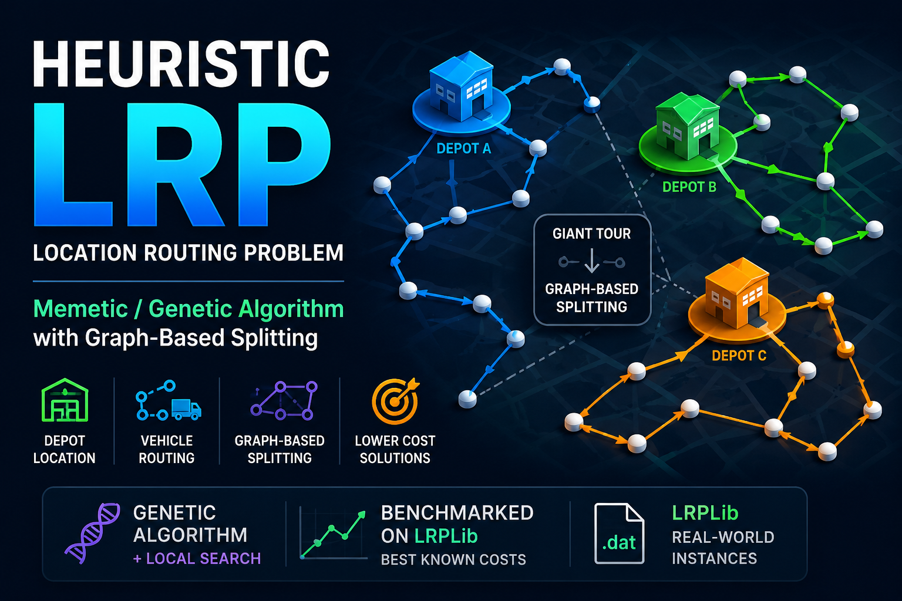

# Heuristic LRP Solver (Memetic / Genetic Algorithm)



This project solves **Location Routing Problem (LRP)** instances using a **Memetic Algorithm**
(Genetic Algorithm + Local Search), with instances taken from **LRPLib**.

It is a port of the CVRP solver of the same design. The solver is **LRP-native**: it uses a
**giant tour representation** combined with a **graph-based splitting procedure** that chooses
the serving depot and cuts the tour into routes in the same pass, so location and routing are
decided together rather than in two phases.

Reference: LRPLib – http://prodhonc.free.fr/Instances/instances_us.htm

---

## Problem definition (LRP)

- Given:
  - A set of **candidate depots**, each with a capacity and an opening cost
  - A set of customers with demands
  - Vehicle capacity Q and an opening cost per vehicle
  - Symmetric distance matrix over depots and customers
- Objective — minimize **total cost**:
  - routing cost of every route
  - plus one **vehicle opening cost** per route
  - plus one **depot opening cost** per depot the solution uses
- Constraints:
  - Serve all customers exactly once
  - Each route starts and ends at the **same depot**
  - Vehicle capacity per route
  - **Depot capacity**: the demand shipped from a depot cannot exceed it

Costs are money, not distance. On integer instances the Euclidean distance is scaled by 100,
which is what makes it commensurable with depot openings of ~10⁴ and a vehicle at 1000.

---

## Project structure

```
HEURISTICLRP
├── Algorithm/            # Solver source and LRPLib instances
│   ├── LRPLib/           # LRPLib instances (.dat)
│   │   ├── Instances_Prodhon_LRP/
│   │   ├── Instances_Tuzun_LRP/
│   │   ├── Instances_Barreto_LRP/
│   │   ├── bks.csv           # best known costs extracted from the published tables
│   │   └── files format.txt  # the .dat layout, as published
│   ├── Data/             # Algorithm.Data package
│   │   ├── InputData.java    # parser + distance matrix
│   │   ├── Depot.java        # location, capacity, opening cost
│   │   ├── Location.java     # a point, with distanceTo
│   │   └── BestKnown.java    # bks.csv lookup, shared by benchmark and web
│   ├── Metaheuristics/   # Algorithm.Metaheuristics package
│   │   ├── MetaHeuristic.java
│   │   └── GeneticAlgorithm.java
│   ├── Solution/         # Algorithm.Solution package
│   │   ├── GiantTour.java
│   │   ├── Route.java          # stops + serving depot + cost
│   │   ├── Solution.java       # routes grouped by depot, with their load per depot
│   │   ├── AuxiliaryGraph.java
│   │   ├── AuxiliaryGraphNode.java
│   │   ├── ArcSetter.java      # grows candidate routes, one per candidate depot
│   │   ├── Move.java
│   │   └── LSM/          # Algorithm.Solution.LSM package
│   │       ├── _2Opt.java
│   │       ├── Swap.java
│   │       ├── LeftShift.java
│   │       ├── RightShift.java
│   │       └── LocalSearchMove.java
│   ├── main.java         # Entry point (single instance run)
│   └── benchmark.java    # Entry point (batch run + .csv benchmark gap)
├── Web/                  # landing page + Web.server package
│   ├── server/           # Web.server package (JDK HttpServer, no dependencies)
│   │   ├── Server.java     # Bootstrap + route table
│   │   ├── Http.java       # HTTP/SSE transport helpers
│   │   ├── Instances.java  # Read-only LRPLib dataset access
│   │   └── Solver.java     # /api/solve (SSE) and /api/stop
│   ├── index.html
│   ├── app.js
│   └── styles.css
├── banner.png            # README banner
└── profile.jpg           # Author profile image
```

---

## Algorithm overview

### 1. Representation: Giant Tour

- Each individual is a **permutation of all customers** (giant tour, no depot markers).
- No feasibility, and no depot assignment, is enforced at chromosome level.

### 2. Graph-based split (LRP decoding)

- A **directed auxiliary graph** is built from the giant tour.
- Nodes represent customer positions.
- Arcs represent feasible routes: for each segment, **one candidate route per candidate depot**
  is grown, so the arc set carries the depot choice.
- Arc cost = routing cost of the segment from that depot, plus the vehicle cost, plus the depot
  opening cost when the segment is the first route assigned to that depot.
- A route is rejected when it breaks vehicle capacity, or when its depot has no room left.
- The **shortest source-to-sink path** gives the split.

Because the depot opening cost is paid once per depot however many routes leave it, the
objective is not additive over arcs. Each node therefore keeps several labels, each carrying
its own set of opened depots — a labelling search rather than a plain shortest path. The split
is exact on capacity and correct on cost, but no longer provably optimal for a given tour.

---

## Genetic Algorithm (Memetic framework)

Implemented in `Algorithm/Metaheuristics/GeneticAlgorithm.java`.

### Population
- Initialized using randomized giant tours
- Each individual is decoded using the auxiliary graph

### Selection
- Tournament selection

### Crossover (Graph-based genetic crossover)

- **Not a classical cut-point crossover**
- Parents are combined using the auxiliary graph logic
- Best subsequences from both parents are inherited
- Shortest-path logic decides which segments survive

### Mutation
- Random perturbations on the giant tour

### Local Search (Memetic component)

Applied both inside routes (intra-route) and between routes (inter-route). Moves implemented:
2-Opt, Swap, Left Shift, Right Shift.

Every depot leg a move touches is priced from the depot of the route that opens or closes it,
and a 2-opt reconnection between two depots carries two extra legs the CVRP version never had.
A route replacing another inherits its share of the depot opening cost, so a depot is paid for
exactly once. Inter-route moves are currently restricted to **routes sharing a depot**;
lifting that restriction is a one-line change in `Solution.InterRoutesLocalSearch`.

---

## Parallelism

- Java 23
- Multi-threaded execution
- Parallel:
  - Fitness evaluations
  - Auxiliary graph construction
  - Local search on the split's candidate solutions

---

## Input format (LRPLib)

- Supported files: `.dat`
- A flat stream of whitespace-separated numbers, read positionally:
  customer count, depot count, depot coordinates, customer coordinates, vehicle capacity,
  depot capacities, customer demands, depot opening costs, route opening cost, and a flag for
  real (`1`) or integer (`0`) costs.
- A file whose number count does not match its announced sizes is rejected rather than
  silently misparsed. `Instances_Barreto_LRP/coordOr117.dat` is refused on that basis: its
  depot block carries four columns instead of two, and it has no published result.

Distance computation:
- Euclidean, stored as a dense matrix (LRPLib tops out at 210 nodes)
- Real-cost instances use the raw value; integer-cost instances scale by 100 and **round up**.
  The published format says "truncked", but only rounding up reproduces the published costs —
  on `coord20-5-2b` the optimum comes out at exactly 37542 that way, and 21 below it truncated.

---

## How to run

### Compile

```bash
./compile.sh            # compiles the .java files changed since the last build
./compile.sh --clean    # full rebuild
```

### Run a single instance

Edit `Algorithm/main.java` and set the LRPLib file path, then run:

```bash
java -Xmx4g -cp out main
```

### Run a benchmark (batch)

Edit `Algorithm/benchmark.java` and set the LRPLib directory path, then run:

```bash
java -Xmx4g -cp out benchmark
```

This solves every `.dat` instance in the directory (in ascending size order), looks up each
best known cost in `Algorithm/LRPLib/bks.csv`, and writes a `results <dir>.csv` report with the
gap per instance. Instances the table does not list report `NA`. These `results *.csv` reports
are committed, so a run's numbers stay comparable with the ones before it.

### Self-checks

No test framework — a runnable check that fails loudly if the logic breaks:

```bash
java -cp out Algorithm.Data.InputData  # parser: sizes, depots, demands, distances
```

### Landing page (web UI)

A minimal web front-end lets you pick an LRPLib instance, solve it, watch the live solver log,
and visualize the routes — no build tools or dependencies (uses the JDK's built-in HTTP server).

```bash
bash run-server.sh             # compiles, starts the server, opens the browser
bash kill-server.sh            # stops any running Web.server.Server process
# or run the compiled class directly:
java -cp out Web.server.Server        # port resolution order below
```

Port resolution: a CLI argument (`java -cp out Web.server.Server 9090`) wins; otherwise the
`PORT` value from the `.env` file at the project root is used; otherwise it defaults to `8081`.
Copy `.env.example` to `.env` to change it without touching code.

If that port is already in use, the server exits immediately with a message telling you to stop
the running server (`bash kill-server.sh`) or pass a different port.

Then open `http://localhost:<port>`. Features:

- Select any instance from `Algorithm/LRPLib/` (benchmark → instance dropdowns)
- Dark mode by default (theme toggle top-right, choice persisted)
- Two output panels: a live **solver log** (streamed over Server-Sent Events) and a **routes**
  panel showing the final solution once solving ends, one `Route #k (depot d)` line per vehicle
- **Gap to best known**: read from `bks.csv`; when the instance is not listed, the field is
  simply omitted and everything else works as usual
- **Map view**: depots and customers are drawn as soon as an instance is selected, and the
  colored routes appear once solving ends — each route drawn from **its own depot**, with used
  depots filled and unused ones hollow, and a per-route selector
- Stats line reports cost, route count, **opened depot count**, and time
- **Closing the tab stops the solve**: the server pings the browser every 5s, and a failed ping
  stops the solver. **Stop** works the same way, and both keep the best solution found so far

Run the server from the project root so it can find `.env`, `Algorithm/LRPLib/`, `Web/` and
`profile.jpg`.

---

## Current limitations

- ❌ Inter-route local search only between routes of the same depot
- ❌ No time-to-target statistics
- ❌ Single-objective only (total cost)
- ❌ Homogeneous fleet only

These are planned extensions.

---

## Future work

- Inter-depot local search moves
- Time-to-target statistics
- Multi-objective extensions
- Heterogeneous fleet variants

---

## Author

**Othmane EL YAAKOUBI**  
Backend & Operations Research Engineer  
Specialized in metaheuristics, VRP, and large-scale optimization

---

## Notes

- Results are stochastic
- Multiple runs recommended
- Designed for research and experimentation on LRP instances
